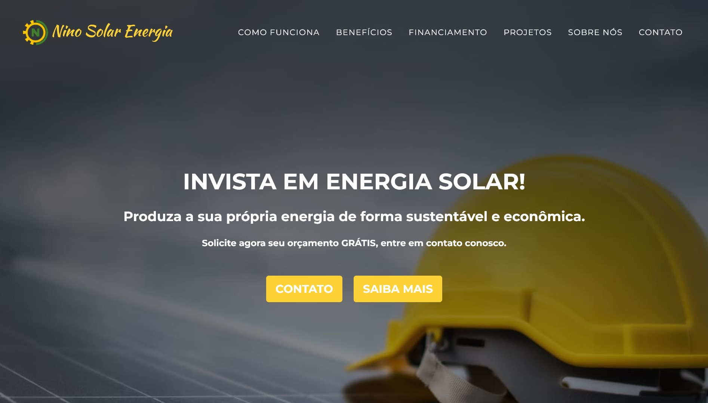
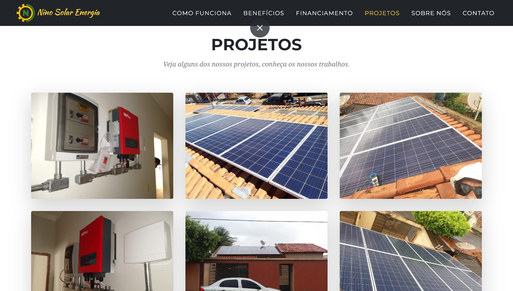
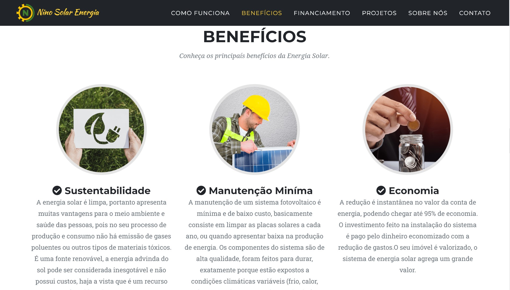
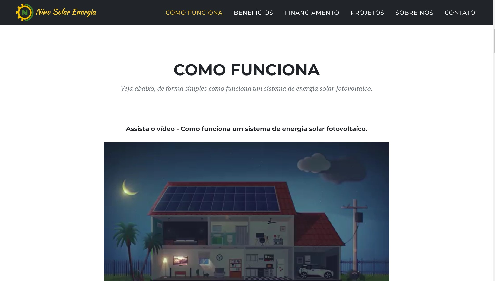
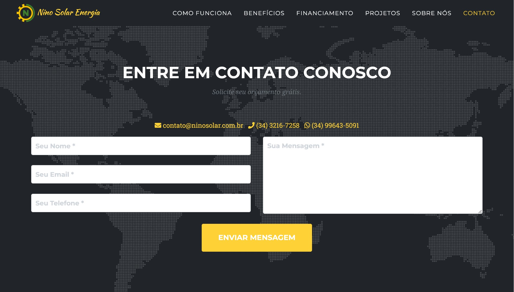

# Página Web para Empresas do ramo de de Energia Solar

Esta é uma Single Page Application (SPA) desenvolvida em HTML5, Bootstrap e PHP, projetada para uma empresa de prestação de serviços na área de energia solar. 
Nesta aplicação, os usuários podem explorar o portfólio da empresa, acessar informações sobre seus serviços e entrar em contato com eles para mais detalhes ou consultas.

## Visão Geral

A página web foi criada para oferecer uma experiência de usuário intuitiva e informativa, permitindo que os visitantes aprendam mais sobre os serviços oferecidos pela empresa e entrem em contato facilmente.

## Recursos Principais

- **Portfólio de Projetos:** Explore uma variedade de projetos de energia solar concluídos pela empresa, com detalhes sobre o escopo, tecnologias utilizadas e resultados alcançados.

- **Informações sobre Serviços:** Acesse informações detalhadas sobre os serviços oferecidos, incluindo instalação de painéis solares, consultoria em eficiência energética e muito mais.

- **Formulário de Contato:** Entre em contato com a empresa facilmente através do formulário de contato integrado. Basta preencher suas informações e enviar uma mensagem diretamente para a equipe.

## Capturas de Tela

Aqui estão algumas capturas de tela das seções principais da página:

### Home

### Portfólio de Projetos

### Benefícios

### Informações sobre Serviços

### Formulário de Contato

